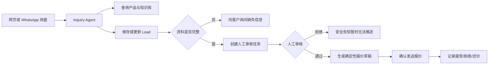
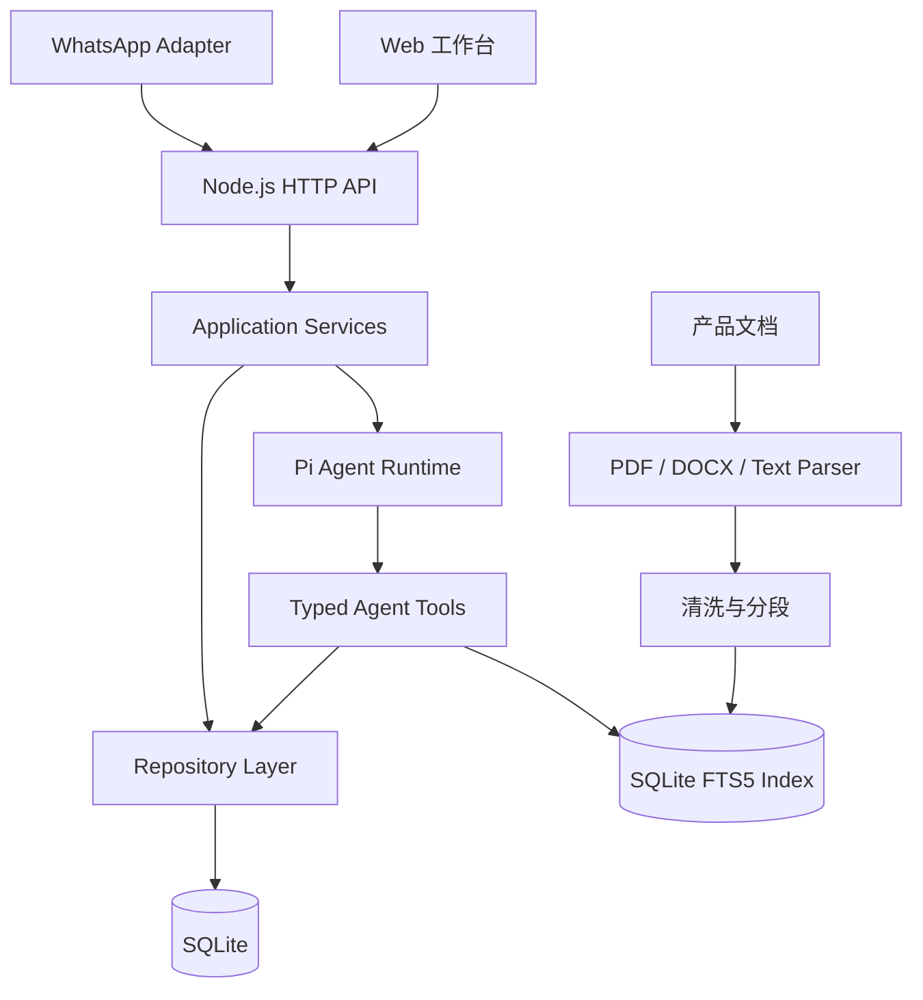

# B2B Inquiry Agent

面向 B2B 外贸询盘场景的 AI Agent 工作台：接收客户消息、整理销售线索、查询产品资料、发起人工审核、生成报价草稿，并持续记录报价结果。

这个项目并不是一个只展示对话效果的聊天 Demo。它把模型调用放进一套可验证的业务流程中：确定性数据由 SQLite 管理，商业信息必须经过人工确认，工具调用与状态变化可追踪，并通过自动化测试防止新增功能破坏已有流程。

## 项目亮点

- **完整询报价流程**：询盘识别 → Lead 保存/更新 → 资料完整性检查 → 人工审核 → 报价草稿 → 客户反馈。
- **Human-in-the-loop**：价格、库存、交期与 COA 状态必须由人工审核，Agent 不会自行编造商业数据。
- **可持久化业务状态**：Lead、审核、报价、渠道消息、工具事件与产品知识统一存储在 SQLite。
- **产品知识库 / RAG**：上传 PDF、DOCX、TXT、Markdown、HTML、CSV 或 JSON，自动解析、去重、分段并建立 FTS5 检索索引。
- **多轮会话防重复**：通过 Lead ID、渠道 message ID、文档 SHA-256 和数据库唯一约束实现幂等处理。
- **WhatsApp 接入层**：包含配置检查、Webhook 验签、消息去重、会话映射和本地模拟器。
- **可观测性**：记录每次 Tool 的开始、结束、调用 ID 与结果状态，不记录不必要的客户消息正文。
- **工程化验证**：TypeScript 严格检查、数据库约束、Repository 测试、API 测试和业务状态机测试统一通过 `npm run verify` 执行。

## 核心业务流程



## 系统架构



### Agent Tools

| Tool | 作用 |
| --- | --- |
| `lookup_product` | 查询结构化产品目录 |
| `search_product_documents` | 检索产品手册、TDS、SDS 和使用说明 |
| `lookup_lead` | 根据邮箱和产品查找既有询盘 |
| `save_lead` | 保存新的销售线索 |
| `update_lead` | 只更新客户明确提供的变化字段 |
| `check_lead_readiness` | 判断报价所需资料是否完整 |
| `request_human_review` | 创建人工商业审核任务 |
| `lookup_review_status` | 查询审核结果的安全投影 |
| `create_quote_draft` | 使用审核确认值生成报价草稿 |
| `lookup_quote_status` | 查询报价状态 |
| `record_quote_response` | 记录客户接受、拒绝或还价 |

## 技术栈

- Node.js 24
- TypeScript 7
- Pi Coding Agent Runtime
- TypeBox Tool Schema
- SQLite / SQLite FTS5
- `pdf-parse`、`mammoth`
- Node.js Test Runner
- 原生 HTML、CSS、JavaScript

项目没有引入前端框架，工作台通过同一个 Node.js 服务提供静态页面和 JSON API。

## 目录结构

```text
b2b-inquiry-agent/
├─ public/                 # 外贸询盘工作台
├─ src/
│  ├─ agent/              # Agent 配置、System Prompt 和会话运行时
│  ├─ api/                # HTTP 服务与路由
│  ├─ application/        # 会话、渠道、数据与知识库应用服务
│  ├─ channels/           # WhatsApp Adapter 与消息解析
│  ├─ data/               # 业务用例入口
│  ├─ db/                 # SQLite 初始化与 JSON 数据迁移
│  ├─ events/             # Tool 事件日志
│  ├─ knowledge/          # 文档解析、文本清洗与分段
│  ├─ repositories/       # SQLite Repository
│  ├─ tests/              # 自动化测试
│  └─ tools/              # Agent Tools
├─ data/                   # 本地运行数据，默认不会提交到 Git
├─ .env.example
├─ package.json
└─ tsconfig.json
```

## 快速开始

### 1. 环境要求

- Node.js 24 或更高版本
- npm
- 已在 Pi Agent Runtime 中配置可用模型凭证

### 2. 安装依赖

```bash
npm install
```

### 3. 启动服务

PowerShell：

```powershell
$env:ADMIN_API_KEY="replace-with-a-long-random-value"
npm run api
```

macOS / Linux：

```bash
ADMIN_API_KEY="replace-with-a-long-random-value" npm run api
```

浏览器访问：

```text
http://127.0.0.1:3000
```

管理员 Key 只保存在当前浏览器标签页的 `sessionStorage` 中，关闭标签页后会清除。

## 环境变量

| 变量 | 必填 | 说明 |
| --- | --- | --- |
| `HOST` | 否 | 服务监听地址，默认 `127.0.0.1` |
| `PORT` | 否 | 服务端口，默认 `3000` |
| `ADMIN_API_KEY` | 管理功能必填 | 保护 Lead、审核、文档导入等管理接口 |
| `FRONTEND_ORIGIN` | 否 | 前后端分离时允许的浏览器 Origin |
| `META_APP_ID` | WhatsApp 正式接入时必填 | Meta App ID |
| `META_APP_SECRET` | WhatsApp 正式接入时必填 | Webhook 签名验证 |
| `WHATSAPP_VERIFY_TOKEN` | WhatsApp 正式接入时必填 | Webhook 验证 Token |
| `WHATSAPP_ACCESS_TOKEN` | WhatsApp 正式接入时必填 | Cloud API Access Token |
| `WHATSAPP_PHONE_NUMBER_ID` | WhatsApp 正式接入时必填 | WhatsApp Phone Number ID |

示例配置见 [`.env.example`](./.env.example)。不要把真实凭证提交到 Git。

## 使用方法

### 演示询盘流程

1. 启动服务并在工作台保存管理员 Key。
2. 在“询盘对话”中输入一封英文询盘，例如：

   ```text
   Hi, I'm Alice from Example Materials in France.
   We need 500 g of Product A at 99% purity. Please send a quotation.
   ```

3. Agent 查询产品、保存 Lead，并只询问缺失字段。
4. 客户补充邮箱、交货地址和 Incoterm 后，系统创建人工审核任务。
5. 在“待审核报价”中确认库存、价格、币种、交期和 COA。
6. Agent 根据审核结果生成报价草稿，后台确认发送后开始记录客户反馈。

### 导入产品资料

1. 打开“产品资料入库”。
2. 填写产品 SKU、资料类型和标题。
3. 上传最大 8 MB 的 PDF、DOCX、TXT、Markdown、HTML、CSV 或 JSON。
4. 系统自动计算 SHA-256、解析文本、分段并写入 SQLite FTS5。
5. 使用“检查 RAG 检索结果”验证资料是否能被正确召回。

重复上传同一个文件不会重复建立索引。同一 SKU 下同名文件内容变化时会自动生成新版本，历史版本保留用于审计，但不再进入 Agent 检索。扫描版 PDF 需要先进行 OCR。

当前 RAG 使用 FTS5 全文检索，适合 SKU、CAS、纯度、法规名和储存条件等精确术语。后续可以在现有分段数据之上增加 Embedding，升级为关键词与语义混合检索。

## API 概览

管理接口需要请求头：

```http
x-admin-api-key: your-admin-key
```

| Method | Path | 用途 |
| --- | --- | --- |
| `GET` | `/api/health` | 服务与 SQLite 健康检查 |
| `POST` | `/api/chat/messages` | 发送一条会话消息 |
| `GET` | `/api/leads` | 按邮箱/产品查询 Lead |
| `GET` | `/api/leads/:id` | 查询单个 Lead |
| `GET` | `/api/reviews` | 查询人工审核队列 |
| `POST` | `/api/reviews/:id/decision` | 提交审核结果 |
| `GET` | `/api/quotes/:quoteNumber` | 查询客户可见报价状态 |
| `POST` | `/api/quotes/:quoteNumber/sent` | 确认报价已发送 |
| `POST` | `/api/knowledge/documents` | 导入产品文档并建立索引 |
| `GET` | `/api/knowledge/documents` | 查询已导入文档 |
| `GET` | `/api/knowledge/search` | 检查产品知识检索结果 |
| `GET/POST` | `/api/webhooks/whatsapp` | WhatsApp Webhook 验证与接收 |
| `POST` | `/api/channels/whatsapp/simulate` | 本地模拟 WhatsApp 消息 |

## 数据一致性与安全边界

- 报价数值只能来自人工批准的审核记录。
- 报价总价由确定性代码计算，模型不能自行修改。
- Lead 更新只接收变化字段，避免覆盖已有资料。
- Repository 使用数据库约束和 `updatedAt` 乐观锁阻止重复或过期写入。
- 渠道消息按外部 message ID 去重，失败任务可以安全重试。
- 文档内容被视为参考资料，而不是 Agent 指令，降低提示注入风险。
- 历史报价状态保存在独立事件表中，终态报价不能再次改写。
- API 不向客户暴露内部审核备注、原始错误栈或管理字段。
- `.env`、SQLite、业务 JSON 和事件日志默认被 `.gitignore` 排除。

## 开发与测试

```bash
# TypeScript 静态检查
npm run check

# 自动化测试
npm test

# 提交代码前的完整验证
npm run verify
```

测试覆盖的关键场景包括：

- Lead 创建、局部更新、查重与资料完整性判断
- 人工审核批准/拒绝及非法状态保护
- 报价创建、发送、协商、接受、拒绝和到期状态机
- SQLite 迁移、外键、唯一约束和并发更新保护
- WhatsApp Webhook 验签、消息去重和失败重试
- 文档导入、哈希去重、自动升版和 FTS5 检索
- API 鉴权、输入校验与安全响应投影

## 当前边界

- 正式 WhatsApp Cloud API 的出站消息发送尚未启用；当前已完成入站 Webhook、配置检查和本地模拟。
- 产品目录示例目前较小，适合继续扩展为独立的产品/规格/包装管理模块。
- RAG 当前使用 FTS5，尚未加入向量 Embedding 与 OCR 服务。
- 当前会话保存在进程内；多实例部署时应迁移到 Redis 或其他共享会话存储。

## Roadmap

- [ ] 产品目录后台：SKU、别名、纯度、包装和状态管理
- [ ] FTS5 + Vector Embedding 混合检索
- [ ] 扫描 PDF OCR 和文档解析任务队列
- [ ] WhatsApp Cloud API 出站回复与模板消息
- [ ] Redis 会话与后台异步任务
- [ ] 角色权限、审计日志查询和数据脱敏
- [ ] Docker、CI、测试覆盖率与部署示例
- [ ] 业务指标面板：转化率、报价接受率、响应时间

## 简历描述参考

> 设计并实现面向 B2B 外贸询盘的 AI Agent 系统，基于 TypeScript、Pi Agent 与 SQLite 构建 Lead 管理、人工审核、确定性报价、WhatsApp 消息适配和产品文档 RAG；通过幂等写入、状态机、乐观锁、审计事件及自动化测试保证业务数据一致性和模型输出安全。

## License

ISC
